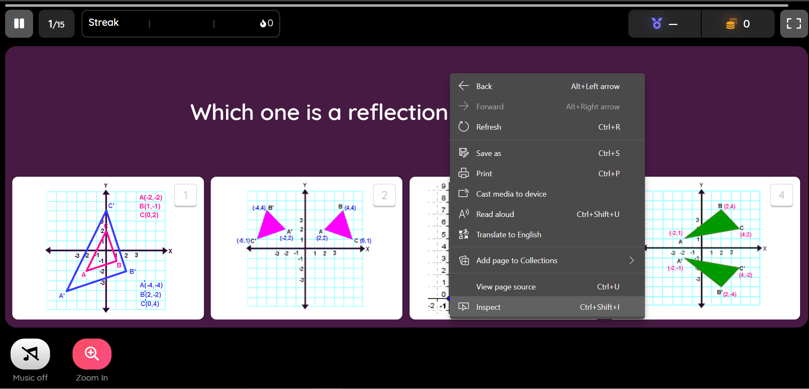
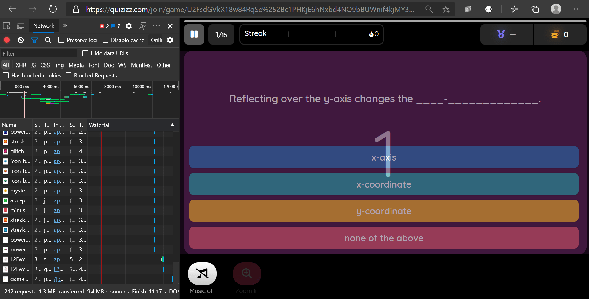
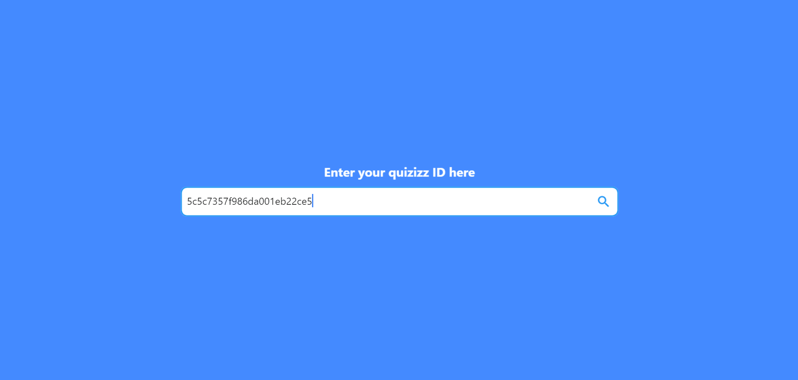

# Quizizz Cheat Website
    This is a website made to cheat on quizizz :sweat_smile:. I know it's a sinful project. 
    **NOTE: This website is built using Flutter Web which is still in beta. The website will take longer for it to startup and the question in the web might not be in order with the question you see in quizizz**.
## Features:
- :white_check_mark: Responsive
- :white_check_mark: Support image-based questions and Answers 
- :ballot_box_with_check: Partial support for questions with math equation
## How To Use:
1. 
    When you're in quizizz.com. Join a room, right click, then inspect or press `Ctrl + Shift + I`.
2. 
    You should see a side screen like this. Go to Network. If you don't see anything, refresh the page.
3. 
    In the filter search bar type `gamesummary` and you should see a file like in the picture. Right click the file and copy the link address.
4.  
    When you copy the link address, it should look like this -> `https://quizizz.com/api/main/gameSummaryRec?quizId=5c5c7357f986da001eb22ce5`. Copy the quiz ID, in my case the quiz ID is `5c5c7357f986da001eb22ce5`, paste it to the search bar and press `Enter`.
5. 
    The website should look like in the image. 
    **NOTE: The questions in the website might not be in order with the questions in quizizz**

